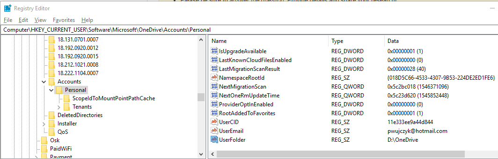

<!--Category:PowerShell--> 
 <p align="right">
    <a href="https://www.powershellgallery.com/packages/ProductivityTools.PSGetOneDriveDirectory/"></a>
    <a href="http://productivitytools.tech/get-onedrivedirectory/"><a> 
    <a href="https://github.com/pwujczyk/ProductivityTools.PSGetOneDriveDirectory"></a>
</p>
<p align="center">
    <a href="http://http://productivitytools.tech/">
        
    </a>
</p>

 
 
# Get-OneDriveDirectory
Get-OneDriveDirectory returns location of the OneDrive files.
<!--more-->

We could have on the computer two OneDrive’s one Personal and second one Corporate (Business). Script by default returns both, but we could use switch parameter to precise our request.

To return directory path module searches through registry.

````powershell
Get-OneDriveDirectory
Get-OneDriveDirectory -Personal
Get-OneDriveDirectory -Business
Get-OneDriveDirectory -Personal -JustDirectory
Get-OneDriveDirectory -Business -JustDirectory
Get-OneDriveDirectory -JustDirectory
````

<!--og-image-->


Information about OneDrive accounts is stored in

```
HKEY_CURRENT_USER\Software\Microsoft\OneDrive\Accounts
```

Under this location we could have two items:

- Personal
- Business

Each account has registry string value (UserFolder) which tells us what is the location of particular OneDrive.

